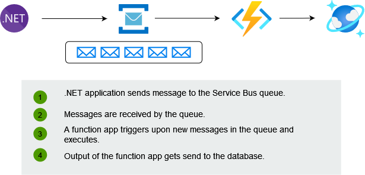

<!-- _theme: default -->
# Design Patterns
## Queue-Based Load Leveling & Publisher-Subscriber Pattern

---

## Queue-Based Load Leveling Pattern
### Problem

Many solutions in the cloud involve running tasks that invoke services. In this environment, if a service is subjected to intermittent heavy loads, it can cause performance or reliability issues.

- How can we reduce the interdependency of tasks and services?
- How can we scale depending on the load on the tasks and the services independently?

---

### Solution

- introduce a queue between the task and the service
  - run asynchronously
  - queue acts as a buffer
- level the load on a service

---

### Benefits

This pattern provides the following benefits:

- maximize availability

- maximize scalability
  - independent scaling meeting demand

- helps to control costs

---

### Considerations and Issues

Consider the following points when deciding how to implement this pattern:

- do not overwhelm the target resource
- one-way communication
- Be careful when autoscaling

---

### When to Use

This pattern is useful to any application that uses services that are subject to overloading.

This pattern isn't useful if the application expects a response from the service with minimal latency.

---

### Example

---

## Publisher-Subscriber Pattern
### Problem

Distributed applications, components of the system often need to provide information to other components as events happen.

- Dedicated message queue for each consumer does not effectively scale to many consumers.
- Some of the consumers might be interested in only a subset of the information. How can the sender announce events to all interested consumers without knowing their identities?
---

### Solution

Asynchronous messaging subsystem:
- An input messaging channel used by the sender.
  - aka the ***publisher***
- One output messaging channel per consumer.
  - aka the ***subscriber***

---

- A mechanism for copying each message from the input channel to the output channels for all subscribers interested in that message. 
  - aka ***topics***
  

---

### Benefits

- decouples subsystems

- increases scalability and improves responsiveness of the sender
  - message broker is responsible for delivery

- allows for deferred or scheduled processing

- improves testability

- provides separation of concerns for your applications

---

## Publisher-Subscriber Pattern
### Considerations and Issues

- use existing technologies
- still one-way
- order is not guarenteed
- malformed messages
- repeated messages

---

## Publisher-Subscriber Pattern
### When to Use

- broadcast information to a significant number of consumers.

- communicate with one or more independently-developed applications or services, which may use different platforms, programming languages, and communication protocols.

- send information to consumers without requiring real-time responses from the consumers.

---

### Example

---

## Useful Links

- [Queue Based Load Leveling (Azure)](https://docs.microsoft.com/en-us/azure/architecture/patterns/queue-based-load-leveling)

- [Pub/Sub Pattern (AWS)](https://docs.aws.amazon.com/prescriptive-guidance/latest/modernization-integrating-microservices/pub-sub.html)

- [Demo Code](https://github.com/andrestoll/cloud-patterns)