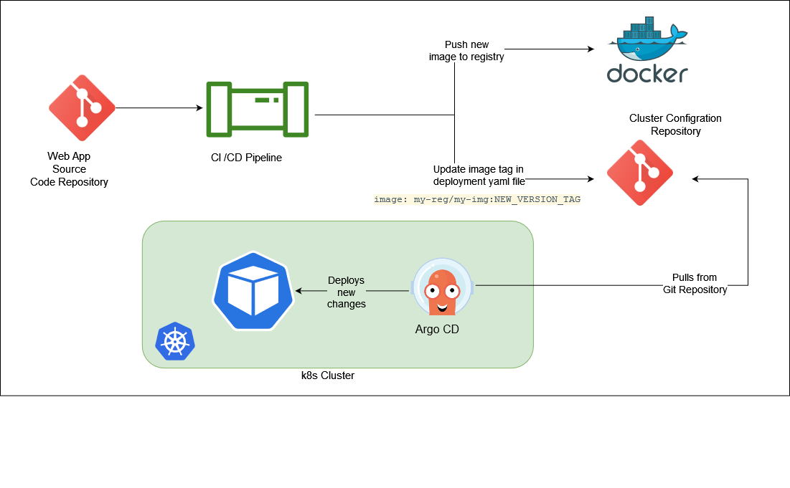

<!-- _class: lead invert -->
# GIT Ops
### with Argo CD

---
# What is Git Ops?

- Treat IaC the same way as application code

- Git is single source of truth

<br>
<br>

IaC + Version Control + PR / Merge Requests + CI/CD Pipeline

---
<!-- _footer: 'Image source: https://www.gitops.tech/' -->
## GitOps Flow: Push-based 


---
<!-- _footer: 'Image source: https://www.gitops.tech/' -->
## GitOps Flow: Pull-based


--- 
## Benefits and Downsides
<br>

| Benefits      | Downsides |
| ----------- | ----------- |
| - Automated Process<br>- Greater collaboration<br>- More Transparent<br>- Easy Rollback<br>- Enhanced security | - “change by committee”<br>- can be cumbersome |


---
<!-- _footer: 'Image source: https://argo-cd.readthedocs.io/en/stable/' -->
## Argo CD

Declarative, GitOps continuous delivery tool for Kubernetes 

- pull-based deployment
- UI dashboard
- webhook integration
- ability to manage and deploy to multiple clusters


---

```yaml
apiVersion: argoproj.io/v1alpha1
kind: Application
metadata:
  name: web-app
  namespace: argocd
spec:
  project: dev
  source:
    repoURL: git@github.com:Obiuzera/hackday.git
    targetRevision: HEAD
    path: web-app
  destination:
    server: https://kubernetes.default.svc
    namespace: web-app
  syncPolicy:
    automated:
      prune: true 
      selfHeal: true
```

--- 



---
## Useful Links

- Argo CD:
    - https://argo-cd.readthedocs.io/en/stable/
- Argo CD Best Practices:
    - https://argo-cd.readthedocs.io/en/stable/user-guide/best_practices/
- Flux CD:
    - https://fluxcd.io/