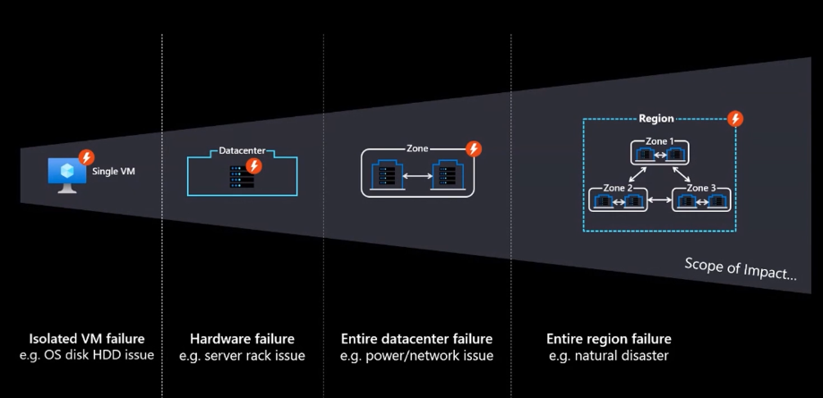
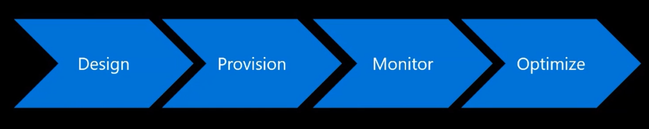

<!-- _class: lead invert -->
# The Well-Architected Framework
## Build a secure, high-performing, resilient, and efficient cloud infrastructure
### Part 1
---
## Five+ pillars

---

## Reliability

- Resiliency
    - ability of system to recover from failure and continue to function
- Availability
    - whether your users can access your workload when they need to
    - percentage uptime

**Choosing and confugring the right building blocks and making sure the application understands that its living in the cloud.**

---
## Reliability
#### Goal

- Cloud applications must be designed to expect occasional failures and recover from them.
- Instead of trying to prevent failures altogether, the goal is to minimize the effects of a single failing component.

---

## Reliability
#### Design: Principles and Best Practices

- Define and test availability and recovery targets and build them into your application
    - BCDR Strategy
    - SLA, SLO, RPO & RTO
- Design applications to be resistant to failures
    - Tactical & strategic
- Recover from errors & automatically recover from failure
- Design resilience to respond to outages
    - e.g. through redundancy
- Plan for disaster recovery

---

## Reliability
#### Design: Principles and Best Practices

- Use fault isolation to protect your workload
- Use Availability Zones where applicable to improve reliability and optimize costs.
- Identify possible failure points in the system with failure mode analysis
- Eliminate all single point of failure.
- Design for scalability
- Backup Data
- Use the native resiliency capabilities of PaaS to support overall application reliability
- Use zone-aware services

---

## Reliability
### Design: Example

---

## Reliability
#### Testing: Principles and Best Practices

- Test recovery procedures
- Test regularly
- Test as part of each major change
- Automate as much as possible
- Test for resiliency

---

## Reliability
#### Testing: Principles and Best Practices

- Design a backup strategy and test it
- Design a disaster recovery strategy and test it
- Codify steps to failover and fallback abnd test it
- Plan for regional failures
- Perform chaos testing by injecting faults and apply chaos principles continuously
- Monitor and measure application health

---

## Cost Optimization

- Managing costs to maximize the value delivered.

- Culture of cost-awareness  

--- 

## Cost Optimization: Stages

---

## Cost Optimization: Design Stage

### Cost Model

- Capture clear requirements
- Estimate the initial cost
    - Price Calculator, TCO Calculator, Azure Migrate, AWS Cost Explorer
- Define policies for the cost constraints defined by the organization
- Identify shared assets
- Plan a governance strategy

---

## Cost Optimization: Design Stage

### Architecture

- Check the cost of resources in various Azure geographic region
- Choose a subscription that is appropriate for the workload
- Choose the right resources to handle the performance
- Compare consumption-based pricing with pre-provisioned cost
- Use proof-of-concept deployments
- Choose managed services when possible

---

## Cost Optimization: Monitor Stage

### Reports
- Gather cost data from diverse sources to create reports
- Use resource tag policies to build reports
### Budgets and Alerts
- Respond to alerts and have a response plan according to the constraints
- Revise budgets

---
## Cost Optimization: Monitor Stage

### Reviews
- Adopt both proactive and reactive approaches for cost reviews
- Analyze the cost at all scopes
- Detect anomalies
- Use Visualization tools to analyze cost information

---
## Cost Optimization: Tradeoffs

### Cost vs. Reliability

Cost has a direct correlation with reliability.

If the cost of high availability exceeds the cost of downtime, you can save by using Azure platform-managed replication and recover data from the backup storage.

---

## Useful Links

- [Azure Well-Architected Framework](https://docs.microsoft.com/en-us/azure/architecture/framework/)
- [AWS Well-Architected Framework](https://aws.amazon.com/architecture/well-architected/?wa-lens-whitepapers.sort-by=item.additionalFields.sortDate&wa-lens-whitepapers.sort-order=desc)
- [Reliability Design Patterns](https://docs.microsoft.com/en-us/azure/architecture/framework/resiliency/reliability-patterns)

- [Reliability Pillar (AWS)](https://docs.aws.amazon.com/wellarchitected/latest/reliability-pillar/welcome.html)

- [Netflix chaos monkey](https://github.com/Netflix/chaosmonkey)
