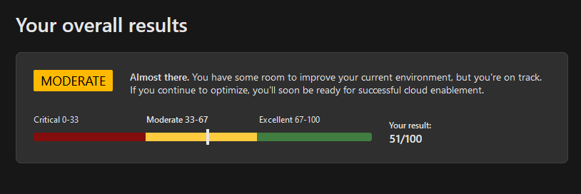
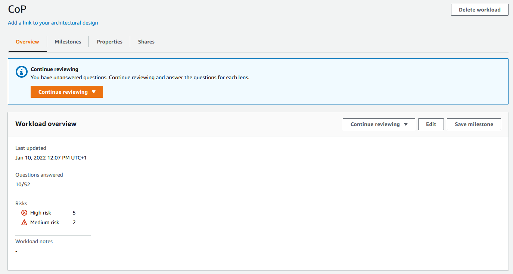

<!-- _class: lead invert -->
# The Well-Architected Framework
## Build a secure, high-performing, resilient, and efficient cloud infrastructure
### Part 3

---

## Security

#### Protecting applications and data from threats.

---

## Security: Shared Responsibility

#### Security "OF" the cloud vs "IN" the cloud

---

## Security: Design Principles
- Align security priorities to mission
    - Identify risks and compliance criteria
- Drive simplicity
- Embrace automation
- Use identity as primary access control

---

## Security: Design Principles
- Accountability & enable traceability
- Apply security at all layers
    - Defense in depth
- Assume zero trust
- Drive continuous improvement
- Educate and incentivize security

---

## Security: Design Principle TLDR;
### What to do first?

- IAM
- Automation
- Enable detection
- Prepare for an incident
- Landing zones

---

## Security: IAM

- Treat identity as the primary security perimeter
- Principle of least privilege
- Use role-based access control
    - Use built-in roles
- Enforce conditional access for admins - Zero Trust
- Enforce multi-factor verification for users

--- 
## Security: Helpful Tools
### Azure
- [Azure Advisor](https://azure.microsoft.com/de-de/services/advisor/#overview)
- [Microsoft Defender for Cloud](https://azure.microsoft.com/de-de/services/defender-for-cloud/#overview)
- [Azure Sentinel](https://azure.microsoft.com/de-de/services/microsoft-sentinel/#overview)

### AWS
- [AWS Trusted Advisor](https://aws.amazon.com/premiumsupport/technology/trusted-advisor/)
- [Amazon Security Hub](https://docs.aws.amazon.com/securityhub/?id=docs_gateway)
- [Amazon Detective](https://docs.aws.amazon.com/detective/?id=docs_gateway)
- [Amazon GuardDuty](https://docs.aws.amazon.com/guardduty/?id=docs_gateway)

--- 
## Azure Well-Architected Review

---
## AWS Well-Architected Tool

---

## Useful Links

- [Security Pillar (Azure)](https://docs.microsoft.com/en-us/azure/architecture/framework/security/overview)

- [Security Fundamentals (Azure)](https://docs.microsoft.com/en-us/azure/security/fundamentals/)

- [Security Pillar (AWS)](https://docs.aws.amazon.com/wellarchitected/latest/security-pillar/welcome.html)

- [IAM Best Practices (Azure)](https://docs.microsoft.com/en-us/azure/security/fundamentals/identity-management-best-practices?bc=%2fazure%2farchitecture%2fbread%2ftoc.json&toc=%2fazure%2farchitecture%2ftoc.json)

- [Well-Architected Labs (AWS)](https://wellarchitectedlabs.com/)

- [Well-Architected Center (Azure)](https://docs.microsoft.com/en-us/azure/architecture/browse/)
